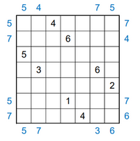

# TwentyFourSeven
This folder contains a solver for the Twenty Four Seven 2-by-2 puzzle

## puzzle description
Credit for these puzzles are to the [Jane Street Puzzle team](https://janestreet.com/puzzles/).
Example: the following puzzle is the same as puzzle1.txt


Rules:
1. place one 1's, two 2's, ..., up to seven 7's on the board
2. there must be exactly 4 numbers in each row and column
3. each row and column must sum up to 20
4. the board must satisfy the "seen" constraints in blue, which indicates the first number seen looking from the given row/column
5. no 2x2 region can contain 4 numbers
6. in the final solution, the numbers must form one connected piece of land (must be connected orthogonally)

## to run
on linux:
```bash
g++ -std=c++11 main.cpp -o main
./main puzzleX.txt
```
where X represents the puzzle number. In this folder are 8 puzzles listed from 1-8.

## how the solver works
At its core, the solver uses a bruteforce method, where it iterates across each element in the grid and attempts to place a number in the board. Once it reaches a puzzle with no valid solution it backtracks and searches other solution paths.

### "level 1" constraints
In the first iteration of the solver, it would simply check if any of the puzzle constraints are violated. This is what I call level 1 constraints. This approach was good enough for most puzzles, however, it was slow requiring anywhere from 1s to 1000s to find a solution, and it could not solve puzzle4.

### "level 2" constraints
The level 2 constraints was introduced to attempt to improve the time to arrive at a solution. Level two constraints work by considering the interaction of the given numbers, and the "seen" constraints in each row and column.

For example if we look at row 1 (0 indexed) in puzzle1, the presence of the seen constraints 7 and 4, and the given of 6, implies that the remaining number is 3 in this row. Furthermore, there are only allowed 3 3's on the board, by deducing that 3 is required in row 0, we restrict the availability of 3's on the rest of the board. 

By performing this level 2 check, the solver is now able to solve puzzle4 within 4s.

## example input file
The input file for puzzle1 is as follows:
```
8
0 2 4
1 3 6
2 0 5
3 1 3
3 5 6
4 6 2
5 3 1
6 4 4

5 7
7 4
0 0
0 0
0 0
5 7
7 6

5 5
4 7
0 0
0 0
0 0
7 3
5 6
```
The first section gives the number of givens (8) and their location on the grid, given as (i, j, n).
The second section gives the rowise seen constraints looking from left to right. A value of 0 means there are no constraints.
The third section gives the columnwise seen constraints looking from top to bottom. A value of 0 means there are no constraints.

## future improvements
-this method currently considers the puzzle rowise, and columnwise, independenly of each other. I am wondering if there are ways to eleminate more solution possiblities by considering the interaction of columns and rows.

I am looking for ways to improve this solver. If you have any suggestions, or puzzle inputs to test, feel free to contact me!